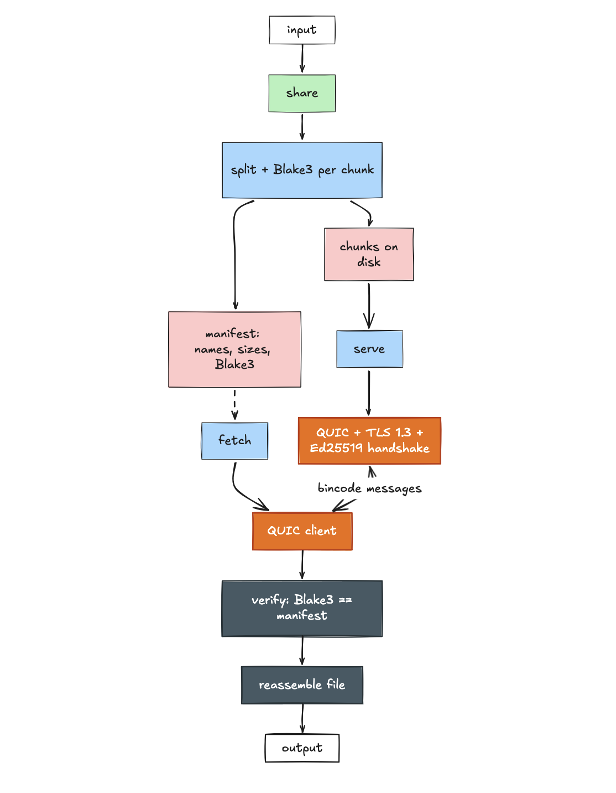

## Godec - An Image codec

Godec is a minimal image codec written in Go from first principles.

## Architecture

It encodes images by converting them to grayscale, applying delta encoding, and compressing the result using run-length encoding (RLE), storing the output in a custom .gdc binary format.

The decoder reverses this pipeline to reconstruct the image, enabling a full encode–decode cycle.

This project is intended for learning purpose only :)
